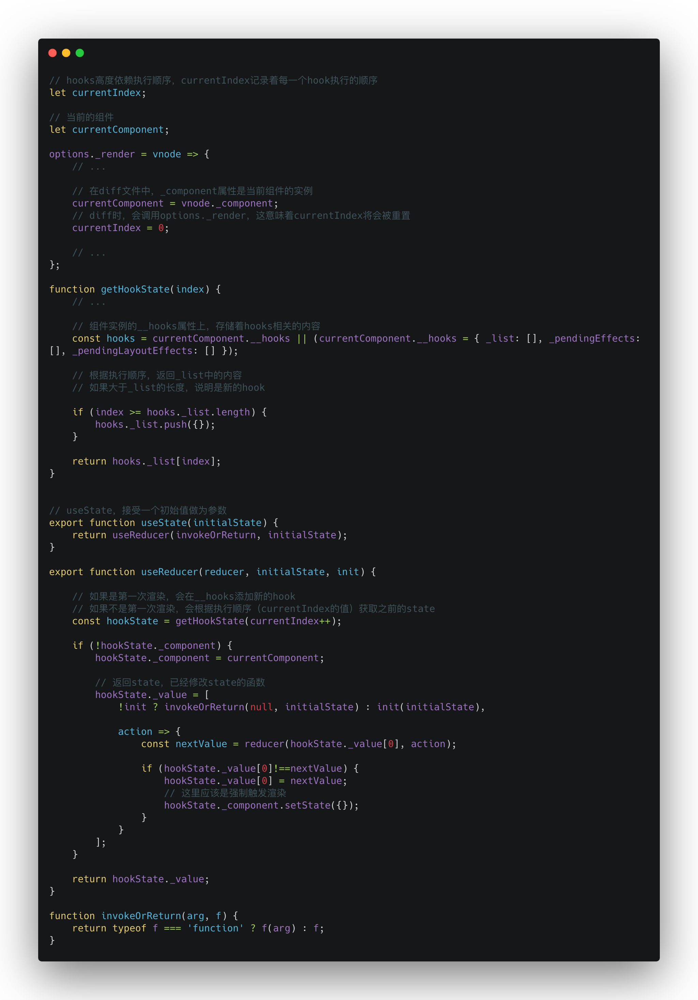

先上一波网上看到的 preact 原理图



然后上一波简单的代码

```javascript
import React, { useState, Component } from "react";
import ReactDOM from "react-dom";
import "./styles.css";

class ComponentExample extends Component {
  constructor() {
    super();
    this.state = {
      count: 0
    };
  }
  handleButtonClick() {
    this.setState({
      count: this.state.count + 1
    });
  }
  render() {
    return (
      <div>
        <p>classComponent: you clicked {this.state.count} times</p>
        <button onClick={this.handleButtonClick.bind(this)}>
          classClickMe
        </button>
      </div>
    );
  }
}

function Example() {
  // 声明一个叫 “count” 的 state 变量。
  const [count, setCount] = useState(0);

  return (
    <div>
      <p>functionComponent: You clicked {count} times</p>
      <button onClick={() => setCount(count + 1)}>Click me</button>
    </div>
  );
}

function App() {
  return (
    <div className="App">
      <ComponentExample />
      <Example />
    </div>
  );
}

const rootElement = document.getElementById("root");
ReactDOM.render(<App />, rootElement);

```

效果地址：[点我](https://codesandbox.io/embed/reactpractice-8o2jq?fontsize=14)

后续计划学习useEffect Hooks和 Class 组件生命周期的不同实现