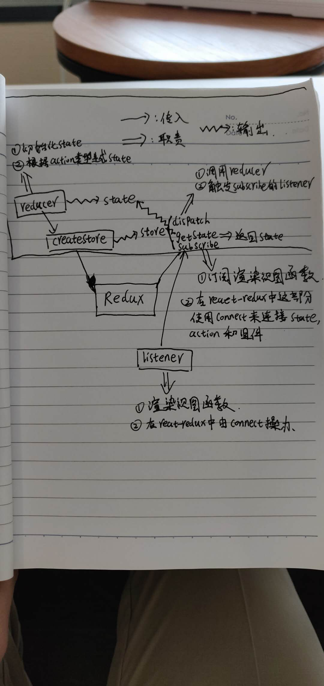

**2019/8/14 update**

我所理解的 Redux 之 react-redux。



---

```javascript
// 用下面的方法可以创建一个 store
function createStore (reducer) {
  let state = null
  const listeners = []
  const subscribe = (listener) => listeners.push(listener)
  const getState = () => state
  const dispatch = (action) => {
    state = reducer(state, action)
    listeners.forEach((listener) => listener())
  }
  dispatch({}) // 初始化 state
  return { getState, dispatch, subscribe }
}
```

```javascript
// 一个 reducer 应该包含初始化的 state 以及修改 state 的 action，如下就是一个 reducer 例子
function themeReducer (state, action) {
  if (!state) return {
    themeName: 'Red Theme',
    themeColor: 'red'
  }
  switch (action.type) {
    case 'UPATE_THEME_NAME':
      return { ...state, themeName: action.themeName }
    case 'UPATE_THEME_COLOR':
      return { ...state, themeColor: action.themeColor }
    default:
      return state
  }
}
const store = createStore(themeReducer)
```


**subscribe 订阅的渲染函数及订阅的渲染过程如下所示**：

```javascript
// 渲染函数示例
function renderApp (newAppState, oldAppState = {}) { // 防止 oldAppState 没有传入，所以加了默认参数 oldAppState = {}
  if (newAppState === oldAppState) return // 数据没有变化就不渲染了
  console.log('render app...')
  renderTitle(newAppState.title, oldAppState.title)
  renderContent(newAppState.content, oldAppState.content)
}

function renderTitle (newTitle, oldTitle = {}) {
  if (newTitle === oldTitle) return // 数据没有变化就不渲染了
  console.log('render title...')
  const titleDOM = document.getElementById('title')
  titleDOM.innerHTML = newTitle.text
  titleDOM.style.color = newTitle.color
}

function renderContent (newContent, oldContent = {}) {
  if (newContent === oldContent) return // 数据没有变化就不渲染了
  console.log('render content...')
  const contentDOM = document.getElementById('content')
  contentDOM.innerHTML = newContent.text
  contentDOM.style.color = newContent.color
}

// 渲染过程示例
const store = createStore(appState, stateChanger)
let oldState = store.getState() // 缓存旧的 state
store.subscribe(() => {
  const newState = store.getState() // 数据可能变化，获取新的 state
  renderApp(newState, oldState) // 把新旧的 state 传进去渲染
  oldState = newState // 渲染完以后，新的 newState 变成了旧的 oldState，等待下一次数据变化重新渲染
})
```

